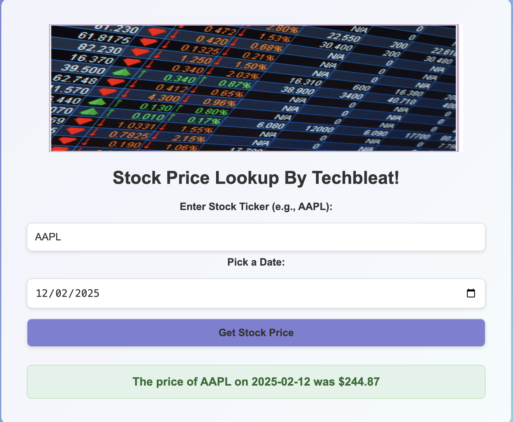

# Stockprice

Stock Price Cache Application  [ By Techbleat ]

This project consists of a **FastAPI** service that fetches stock prices from a **Spring Boot** application, which caches the data in **Redis**. The services are orchestrated using **Docker Compose**. Additionally, there is a **web interface** (`index.html`) that allows users to interact with the application through a simple UI.

## Services Overview

1. **FastAPI** (`stock-api`): This service exposes an API that allows clients to get stock prices by providing a ticker symbol and date. It first checks the cache (Redis) via the Spring Boot application, and if the data is not available, it fetches the data externally (mocked in this case) and stores it in Redis.
   
2. **Spring Boot** (`stock-cache`): This service provides caching capabilities, storing and retrieving stock prices in Redis.

3. **Redis** (`redis`): The cache store where stock prices are stored temporarily.

4. **Web Frontend** (`index.html`): A simple web page that allows users to input a stock ticker and date to retrieve stock price information and  see the result.

# The project Architecture
1. Frontend: Deployed using nginx on an Ec2 server
a: created modules for ec2,vpc,rds,security,load balancer, auto scaling